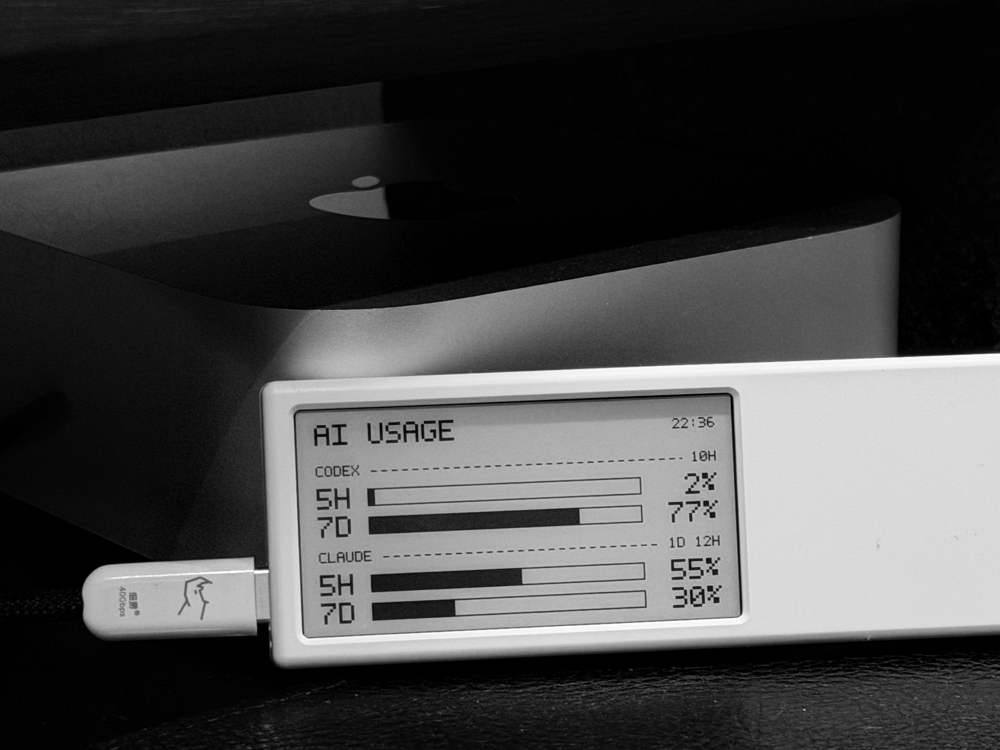
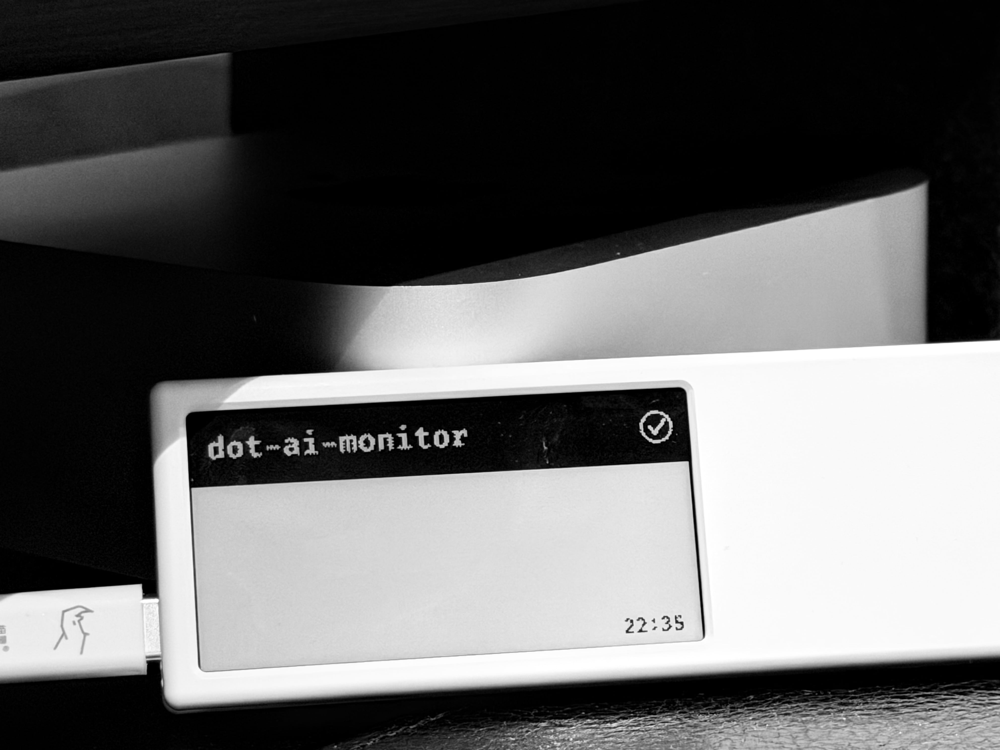

# dot-ai-monitor

把 AI 编程助手的工作状态和用量信息，显示在 [Dot 电子墨水屏](https://dot.mindreset.tech/) 上。

<p>
  
  
</p>

## 它做什么

- **有活跃会话时** — 实时显示每个 Claude Code 会话的状态（运行中 / 等待权限 / 已完成）
- **空闲时** — 显示 Claude 和 Codex 的 token 用量（5 小时 / 7 天窗口 + 进度条）
- 会话状态通过 [Claude Code Hooks](https://docs.anthropic.com/en/docs/claude-code/hooks) 自动推送，用量信息通过 cron 定时刷新

### 会话状态说明

| 屏幕显示 | 含义 |
|---------|------|
| 项目名 + 旋转图标 | Claude 正在工作 |
| 项目名 + **!** 三角 | Claude 等待你确认权限 |
| 项目名 (反色行) + **&#10003;** | Claude 已完成，等你查看结果 |

最多同时显示 3 个会话。完成/权限状态 3 分钟后自动消失，回到用量显示。

## 你需要什么

- 一台 [Dot 电子墨水屏](https://dot.mindreset.tech/)（接上电源和 Wi-Fi）
- 在 Dot App 内容工坊中添加「图像 API」到设备任务，获取 API Key
- Node.js 18+
- [Claude Code](https://docs.anthropic.com/en/docs/claude-code) CLI（用于会话状态推送）

## 安装

```bash
git clone https://github.com/RuochenLyu/dot-ai-monitor.git
cd dot-ai-monitor
npm install
```

## 配置

复制 `.env.example` 为 `.env`，填入你的配置：

```bash
cp .env.example .env
```

```env
# === Dot 设备（必填） ===
DOT_API_KEY=dot_app_your_api_key    # Dot App 中获取
DOT_DEVICE_ID=YOUR_DEVICE_ID        # Dot App 中获取
DOT_BASE_URL=https://dot.mindreset.tech  # 默认值，通常不需要改

# === Claude 用量（可选，二选一） ===

# 方式1：Anthropic OAuth Token（推荐）
ANTHROPIC_OAUTH_TOKEN=your_oauth_access_token

# 方式2：自定义 API（兼容 sub2api 等代理）
# CLAUDE_USAGE_API_URL=https://your-api-url.com
# CLAUDE_USAGE_API_KEY=your_api_key
# CLAUDE_USAGE_ACCOUNT_ID=1

# === 其他 ===
TZ=Asia/Shanghai
```

> Codex 用量始终从本地 `~/.codex/sessions/` 自动读取，无需额外配置。
> 如果不配置 Claude 用量，空闲时 Claude 部分显示为 `--`。

### Claude 用量获取方式

| 方式 | 适用场景 | 配置 |
|-----|---------|------|
| Anthropic OAuth Token | Claude Pro/Max 订阅用户 | 设置 `ANTHROPIC_OAUTH_TOKEN` |
| 自定义 API | 使用 [sub2api](https://github.com/Wei-Shaw/sub2api) 等代理 | 设置 `CLAUDE_USAGE_API_URL` + `CLAUDE_USAGE_API_KEY` |

## 设置 Claude Code Hooks

在 `~/.claude/settings.json` 中添加以下内容，将 `/path/to` 替换为你的实际安装路径：

```json
{
  "hooks": {
    "UserPromptSubmit": [
      { "hooks": [{ "type": "command", "command": "node /path/to/dot_notify.js", "timeout": 5, "async": true }] }
    ],
    "PreToolUse": [
      { "hooks": [{ "type": "command", "command": "node /path/to/dot_notify.js", "timeout": 5, "async": true }] }
    ],
    "Notification": [
      { "matcher": "permission_prompt", "hooks": [{ "type": "command", "command": "node /path/to/dot_notify.js", "timeout": 5, "async": true }] }
    ],
    "Stop": [
      { "hooks": [{ "type": "command", "command": "node /path/to/dot_notify.js", "timeout": 5, "async": true }] }
    ],
    "SessionEnd": [
      { "hooks": [{ "type": "command", "command": "node /path/to/dot_notify.js", "timeout": 5, "async": true }] }
    ]
  }
}
```

配置完成后，Claude Code 的每次操作都会自动更新 Dot 屏幕。

## 设置定时用量刷新（可选）

添加 cron 任务，让 AI 空闲时自动显示用量信息：

```bash
chmod +x dot_usage.sh
crontab -e
```

添加以下行（每 10 分钟刷新，7:00-23:59）：

```cron
*/10 7-23 * * * /path/to/dot_usage.sh
```

## 测试

```bash
# 生成混合状态测试图并推送到 Dot
node dot_notify.js --test mix

# 获取实际用量数据并推送
node dot_notify.js --test usage

# 其他测试场景: all-run, all-done, single
node dot_notify.js --test all-run
```

## 项目结构

```
dot_notify.js      主程序（Hook 事件处理 + 用量显示 + 图像渲染）
dot_usage.sh       cron 入口脚本（自动查找 node 路径）
fonts/             内置 FiraCode 字体
assets/            预览图片
.env               你的配置（不会提交到 git）
.cache/            运行时缓存（自动创建）
```

## License

MIT
