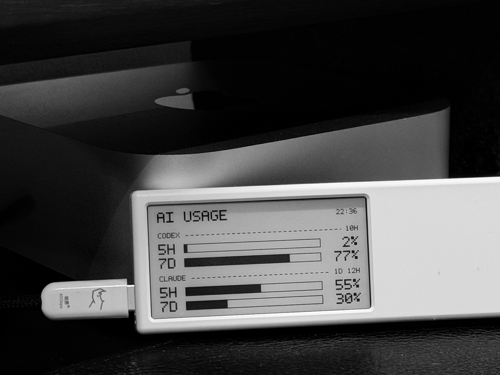
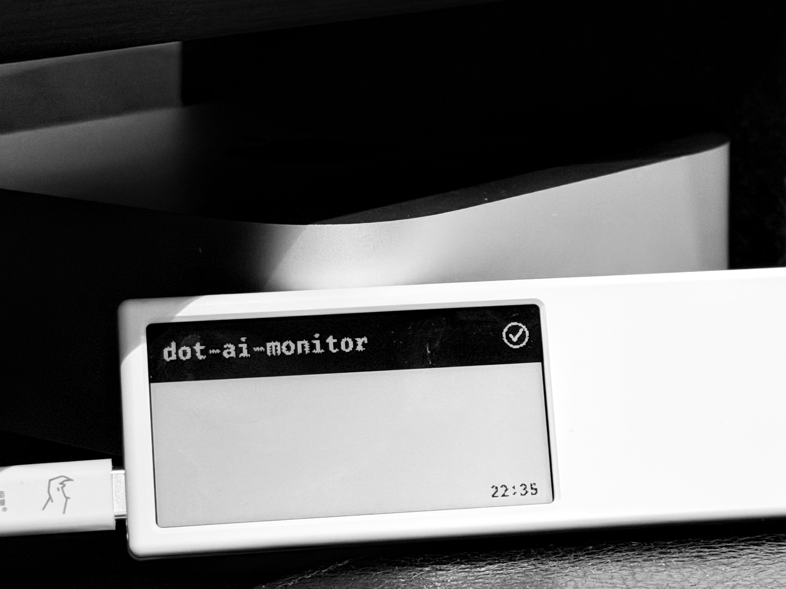

# dot-ai-monitor

把 AI 编程助手的工作状态和用量信息，显示在 [Dot 电子墨水屏](https://dot.mindreset.tech/) 上。

<p>
  
  
</p>

## 它做什么

- **有活跃会话时** — 实时显示每个 Claude Code 会话的状态（运行中 / 等待权限 / 已完成）
- **空闲时** — Codex 显示 7 天额度；Claude 显示多账号平均的 5 小时、7 天和 Fable 7 天额度
- 会话状态通过 [Claude Code Hooks](https://code.claude.com/docs/en/hooks) 自动推送，用量信息通过 cron 定时刷新；如果设备意外白屏，cron 也会重推当前应显示的页面

### 会话状态说明

| 屏幕显示 | 含义 |
|---------|------|
| 项目名 + 旋转图标 | Claude 正在工作 |
| 项目名 + **!** 三角 | Claude 等待你确认权限 |
| 项目名 (反色行) + **&#10003;** | Claude 已完成，等你查看结果 |

会话布局按 3 行设计，并按“已完成 → 等待权限 → 运行中”排序；超过 3 个会话时只保证前三个完整显示。完成/权限状态 3 分钟后自动消失，回到用量显示。

## 你需要什么

- 一台或多台 [Dot 电子墨水屏](https://dot.mindreset.tech/)（接上电源和 Wi-Fi）
- 在每台设备的 Dot App 内容工坊中添加「图像 API」任务，并获取 API Key 与设备 ID
- Node.js 18+
- [Claude Code](https://code.claude.com/docs/en/overview) CLI（用于会话状态推送）
- 支持 App Server 的新版 [Codex CLI](https://learn.chatgpt.com/docs/codex/cli)（用于实时读取 Codex 用量）

## 安装

```bash
git clone https://github.com/RuochenLyu/dot-ai-monitor.git
cd dot-ai-monitor
npm install
```

## 配置

复制 `.env.example` 为 `.env`，填入你的配置：

```bash
cp .env.example .env
```

```env
# === Dot 设备（必填） ===
DOT_API_KEY=dot_app_your_api_key    # Dot App 中获取
DOT_DEVICE_IDS=DEVICE_ID_1,DEVICE_ID_2  # 一个或多个设备，英文逗号分隔
DOT_BASE_URL=https://dot.mindreset.tech  # 默认值，通常不需要改

# === Claude 用量（可选，二选一） ===

# 方式1：Anthropic OAuth Token（推荐）
# macOS 默认自动从 Claude Code Keychain 读取；其他环境可手动设置
# ANTHROPIC_OAUTH_TOKEN=your_oauth_access_token

# 方式2：自定义 API（兼容 sub2api 等代理）
# CLAUDE_USAGE_API_URL=https://your-api-url.com
# CLAUDE_USAGE_API_KEY=your_api_key
# CLAUDE_USAGE_ACCOUNT_IDS=all  # 自动汇总 active Anthropic 订阅账号，也可填 1,5

# === Codex 用量（可选） ===
# 通常会从 PATH、ChatGPT.app 或 Codex.app 自动发现；找不到时可显式指定
# CODEX_BIN=/Applications/ChatGPT.app/Contents/Resources/codex
# CODEX_USAGE_CACHE_TTL_MS=600000  # 毫秒，默认 10 分钟

# === 其他 ===
TZ=Asia/Shanghai
```

> Codex 用量优先通过 App Server 的 `account/rateLimits/read` 实时读取，并缓存 10 分钟；并发刷新会合并为一次查询。接口不可用时自动回退到本地 `~/.codex/sessions/` 快照，并短暂退避后再重试实时接口。
> 实时 Codex 用量要求 Codex 已登录 ChatGPT；无法实时读取时仍可使用本地 session fallback。
> Dot 图像 API 按设备逐台调用。多台设备会复用同一张渲染图片并发更新；单设备配置 `DOT_DEVICE_ID` 仍然兼容。
> sub2api 多账号默认自动发现并汇总所有 active Anthropic OAuth/setup-token 订阅账号；屏幕显示 `CLAUDE xN`，5H/7D 为各账号使用率的平均值，重置倒计时取最近一次账号重置。Fable 只汇总实际返回该字段的账号；全部缺失时显示斜纹占位。可用 `CLAUDE_USAGE_ACCOUNT_IDS=1,5` 限定账号；旧的单账号 `CLAUDE_USAGE_ACCOUNT_ID` 配置仍兼容。
> 如果不配置 Claude 用量，空闲时 Claude 部分显示为 `--`。

### Claude 用量获取方式

| 方式 | 适用场景 | 配置 |
|-----|---------|------|
| Anthropic OAuth Token | Claude Pro/Max 订阅用户 | macOS 自动读取 Claude Code Keychain，或设置 `ANTHROPIC_OAUTH_TOKEN` |
| 自定义 API | 使用 [sub2api](https://github.com/Wei-Shaw/sub2api) 等代理 | 设置 `CLAUDE_USAGE_API_URL` + `CLAUDE_USAGE_API_KEY` |

## 设置 Claude Code Hooks

在 `~/.claude/settings.json` 中添加以下内容，将 `/path/to` 替换为你的实际安装路径：

```json
{
  "hooks": {
    "UserPromptSubmit": [
      { "hooks": [{ "type": "command", "command": "node /path/to/dot_notify.js", "timeout": 5, "async": true }] }
    ],
    "PreToolUse": [
      { "hooks": [{ "type": "command", "command": "node /path/to/dot_notify.js", "timeout": 5, "async": true }] }
    ],
    "Notification": [
      { "matcher": "permission_prompt", "hooks": [{ "type": "command", "command": "node /path/to/dot_notify.js", "timeout": 5, "async": true }] }
    ],
    "Stop": [
      { "hooks": [{ "type": "command", "command": "node /path/to/dot_notify.js", "timeout": 5, "async": true }] }
    ],
    "SessionEnd": [
      { "hooks": [{ "type": "command", "command": "node /path/to/dot_notify.js", "timeout": 5, "async": true }] }
    ]
  }
}
```

配置完成后，Claude Code 的每次操作都会自动更新 Dot 屏幕。

## 设置定时用量刷新（可选）

添加 cron 任务，定时重推当前应显示的页面；空闲时显示用量，有活跃会话时则恢复会话状态：

```bash
chmod +x dot_usage.sh
crontab -e
```

添加以下行（每 10 分钟刷新，7:00-23:59）：

```cron
*/10 7-23 * * * /path/to/dot_usage.sh
```

## 测试

```bash
# 生成混合状态测试图并推送到 Dot
node dot_notify.js --test mix

# 获取实际用量数据并推送
node dot_notify.js --test usage

# 获取实际用量并只生成本地预览（不会推送设备）
npm run preview:usage

# 验证 Codex 实时读取、缓存去重和 session fallback（不会推送设备）
npm run test:codex-usage

# 验证多设备配置解析（不会推送设备）
npm run test:dot-devices

# 其他本地回归（不会推送设备）
npm run test:hook-fallback
npm run test:usage-refresh
npm run test:png-format

# 其他会推送到 Dot 的页面场景: all-run, all-done, single
node dot_notify.js --test all-run
```

## 项目结构

```
dot_notify.js      主程序（Hook 事件处理 + 用量显示 + 图像渲染）
dot_usage.sh       cron 入口脚本（自动查找 node 路径，并定时恢复当前显示）
fonts/             随项目提供的 FiraCode 字体资源
assets/            预览图片
.env               你的配置（不会提交到 git）
.cache/            渲染状态、Codex 用量和锁文件等运行时缓存（自动创建）
```

## License

MIT
